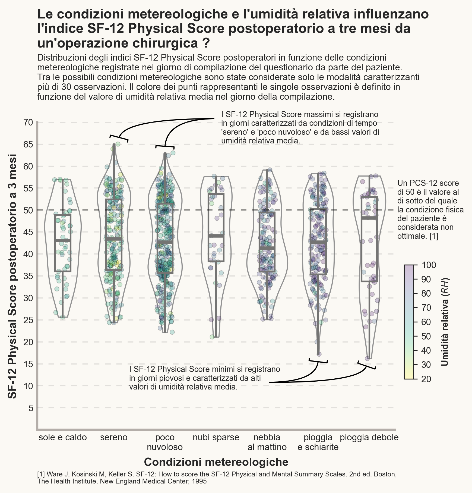
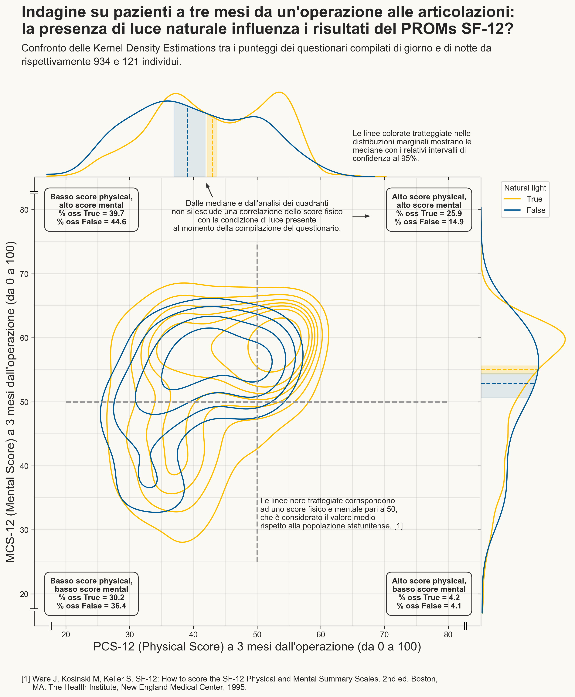

# Portfolio
---
## Data Visualization

### Air quality in the Milan agglomeration: Data Analysis & Visualization

Has air quality improved over the past 15 years in and around Milan? Is the concentration of pollutants higher in winter or summer? and why? What are the main pollutants, and what meteorological and anthropogenic factors influence the seasonal pattern of their concentrations?
 
We tried to answer these, and other, questions by analyzing data from ARPA Lombardy. The results of our analysis were then displayed in an interactive infographic created using the Tableau platform.

 

 
---

### Infographic: PROM score and the possible relationship with weather conditions

PROMs are patient-reported outcome measures following an operation or health treatment, often used to assess the quality of health care.
 
We evaluated the possible presence of a relationship between the outcomes of mental and physical health status assessments of a sample of patients, following surgery, and the weather conditions relative to the time of questionnaire completion.

 

 
---

© 2022 Carbone Giorgio. Powered by Jekyll and the Minimal Theme.
