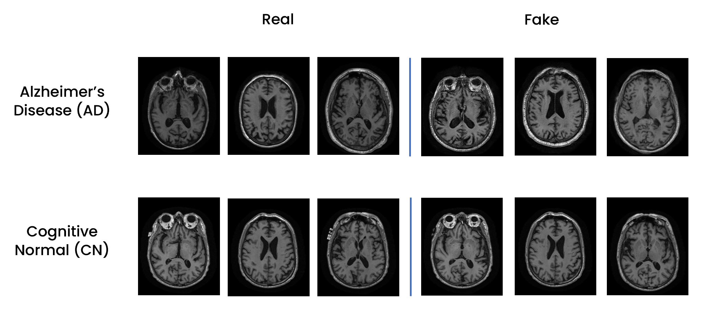
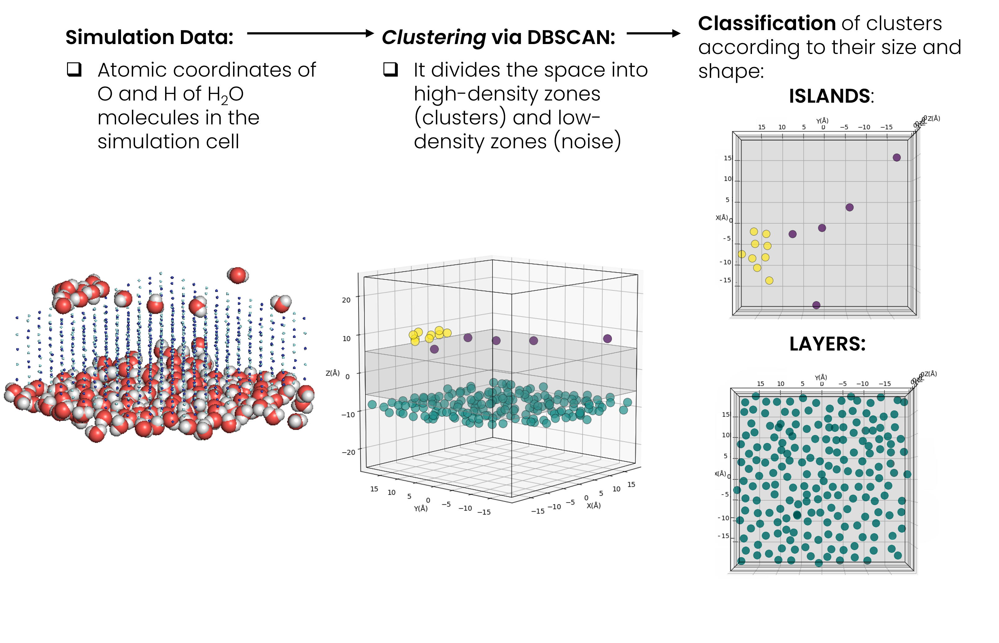
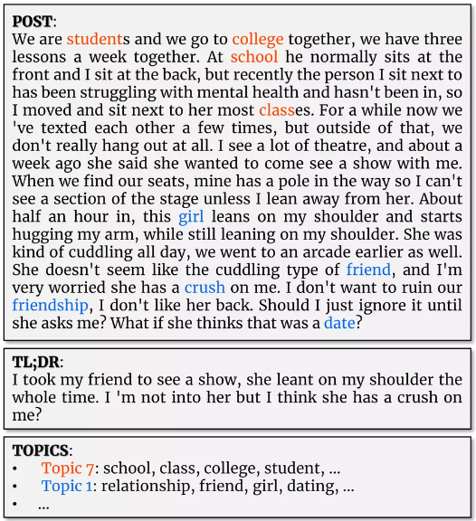
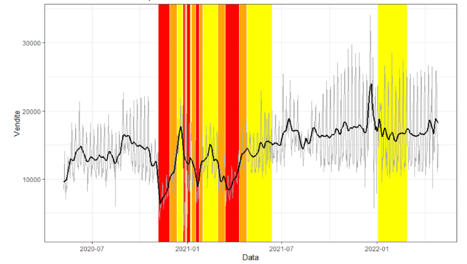

# Portfolio
---

## Deep Learning

### Video Classification: Human Action Recognition on HMDB-51 dataset
_Python_

<b>Two-stream CNNs</b> for video action recognition using Stacked Optical Flows, implemented in <b>Keras</b>, on HMDB-51 dataset.
   
We use spatial (<b>finetuned ResNet-50</b>) and temporal stream CNN (stacked <b>Optical Flows</b>) under the <b>Keras</b> framework to perform <b>Video-Based Human Action Recognition</b> on <b>HMDB-51</b> dataset.

 

 

---
### CXR-ACGAN: Auxiliary Classifier GAN for Chest X-Ray Images Generation

<b>CXR-ACGAN</b>: Auxiliary Classifier GAN (AC-GAN) for <b>Chest X-Ray</b> (CXR) Images Generation (<b>Pneumonia, COVID-19 and healthy</b> patients) for the purpose of <b>data augmentation</b>. Implemented in TensorFlow, trained on COVIDx CXR-3 dataset.
   
The main objective was to train an <b>Auxiliary Classifier GAN</b> (AC-GAN) to obtain a model for the <b>conditional synthesis</b> of chest radiographs of healthy patients, patients with COVID-19 and patients with non-COVID-19 pneumonia. Additionally, we used the trained GAN to perform <b>data augmentation on the unbalanced COVIDx dataset</b>, generatively balancing minority classes, and possibly improving the performance of some classifiers.

 

 

---
### Alzheimers's Disease / Healthy Brain MRI Images Classification and WGAN Generation

<b>Brain</b> T1-Weighted <b>MRI</b> Images <b>Classification</b> and <b>WGAN Generation</b> (<b>Alzheimer's</b> and Healthy patients) for the purpose of data augmentation. Implemented in TensorFlow, trained on ADNI dataset.
   
This project focused on Alzheimer's Disease through three main objectives. Firstly, a dataset of axial 2D slices was created from 3D T1-weighted MRI brain images, integrating clinical, genetic, and biological sample data. Secondly, a <b>Custom Resnet-18</b> was trained to classify these images, distinguishing between healthy individuals and those with Alzheimer's. Lastly, different techniques for managing class imbalance were evaluated to improve the classifier's performance and reduce bias, including the training of a generative model (<b>Wasserstein GAN</b>) on Alzheimer's Disease and Healthy images for the purpose of generative data augmentation.

 

 

---
## Machine Learning

### Credit Card Transactions Fraud Detection using KNIME.

The project consists in the application of <b>different classification models</b> to a dataset containing data relating to credit card transactions for the <b>detection of financial fraud</b>.
   
One of the most critical processes in finance is the <b>detection of fraudulent credit card transactions</b>. It is possible to detect these frauds with different machine learning algorithms, but what is the most effective <b>classifier</b> to accomplish this task?
 
In the first part of the project, we compared different techniques to counter the presence of unbalanced classes within the dataset. Then we compared the performance of some of the most widely used classification algorithms in this area. To determine the best method, we did not limit ourselves to the usual metrics but also took into account the costs to the financial institution related to any errors the model may make, a key aspect in this area.

 

 

---
### <ins>Bachelor's Thesis</ins>: *"Cluster Analysis on the Results of Molecular Simulation of the Water Adsorption Process on Atmospheric Particulate Models"*   and <ins>Published Paper</ins>: *"Theoretical Investigation of Inorganic Particulate Matter: The Case of Water Adsorption on a NaCl Particle Model Studied Using Grand Canonical Monte Carlo Simulations"*

During a <b>research internship</b> at the <b>Computational Physical Chemistry Laboratory</b> at the <b>University of Milano-Bicocca</b> i took part in a research project concerning the study, by means of <b>Monte Carlo computational simulations</b> in the Grand Canonical ensemble, of the <b>adsorption</b> process of <b>water</b> on model <b>surfaces of sodium chloride</b> (NaCl) atmospheric particulate matter of marine origin.  
My work involved performing a data analysis, and in particular a <b>cluster analysis</b> and <b>orientational analysis</b>, on the results of the 3-D molecular mechanics simulations, leveraging <b>unsupervised machine learning</b> (<b>DBSCAN</b>) for water <b>clusters detection</b>.  
I developed a script in Python language (NumPy, pandas, scikit-learn), capable of performing an automated (frame-by-frame) <b>data analysis of the configurations</b> (atomic coordinates of water molecules) generated during each simulation, conducted at a specific H2O pressure value.  
The results of the analysis provided a <b>molecular-level understanding</b> of the <b>aggregative phenomena</b> that characterise the adsorption process of water vapor on the NaCl surface. In particular, the script allows to: identify the number of clusters present in the system, classify them into 'islands' or 'layers' according to their shape and size, and study the orientation of water molecules moving away from the NaCl surface.  
The results of my study are collected in my <b>Bachelor's thesis</b>: <a href="https://github.com/giocoal/cluster-analysis-on-computational-chemistry-simulations-water-adsorption-on-atmosperic-particulate/blob/main/thesis%20manuscript%20and%20presentation%20slides/Thesis.pdf">"Cluster Analysis on the Results of Molecular Simulation of the Water Adsorption Process on Atmospheric Particulate Models."</a>  
Furthermore, during the course of the year 2023, I subsequently contributed, in the context of a voluntary collaboration with the corresponding authors' research groups, to the development of a <b>paper</b> entitled: <a href="https://www.mdpi.com/2304-6740/11/11/421">"Theoretical Investigation of Inorganic Particulate Matter: The Case of Water Adsorption on a NaCl Particle Model Studied Using Grand Canonical Monte Carlo Simulations."</a> (<a href="https://scholar.google.com/citations?user=yJfbN8AAAAAJ&hl=en&oi=sra">F. Rizza</a>, <a href="https://scholar.google.com/citations?user=F4g_VMYAAAAJ&hl=en&oi=sra">A. Rovaletti</a>, <a href="https://scholar.google.com/citations?user=C9pWqXAAAAAJ&hl=en&oi=sra">G. Carbone</a>, T. Miyake, <a href="url">C. Greco</a>, U. Cosentino), published on the international, peer-reviews and open access <a href="https://www.mdpi.com/journal/inorganics/about">Inorganics</a> journal by <a href="https://www.mdpi.com/">MDPI</a>. In particular, I was involved in the investigation, formal analysis and data curation phases.  

 

 

---
## Natural Language Processing

### Word Embedding (Word2Vec and CADE): the evolution of tópoi in the Italian literary tradition

Using <b>distibuctional semantics</b> (<b>word2vec</b> family algorithms and the <b>CADE</b> framework) to learn <b>word embeddings</b> from the <b>Italian</b> literary corpuses we generated.
   
The <b>goals</b> of our project were: 
 
<b>1.</b> to <b>obtain corpora</b> that were consistent with our research questions from a collection of texts obtained from two main sources 
 
<b>2.</b> to use distibutional semantics, and in particular algorithms from the word2vec family, along with the CADE framework, in order to learn <b>word embeddings</b> from the generated and processed corpora 
 
<b>3.</b> and finally to <b>analyze</b> some particularly <b>long-lived tòpos</b>, chosen arbitrarily, to be able to answer some research questions

 

 

---
### Extreme Text Summarization and Topic Modeling over Reddit Posts

Extreme Extractive <b>Text Summarization</b> and <b>Topic Modeling</b> (using <b>LSA and LDA</b> techniques) over Reddit Posts from <b>TLDRHQ dataset</b>.
   
TL;DR, which is an acronym for ”Too Long; Didn’t Read” and is an extremely short summary of the post’s content that is good practice for Reddit users to leave at the end of a post. A system, such as a bot, capable to automatically generate the TL;DR of a post could improve Reddit usability. This project develops a supervised extractive summarization model to obtain TL;DR-like summaries, and uses LSA and LDA techniques for topic modeling analysis to identify hidden topics in posts

 

 

---
## Time Series and Streaming Data 

### Electricity Consumption Forecasting Using Arima, UCM, Machine Learning (Random Forest and k-NN), and Deep Learning (GRU Recurrent Neural Network) Models

The <b>forecasting</b> of <b>time series</b> of <b>electricity consumption</b> plays an important role in efficient resource management and strategic planning in the energy sector. In this project, we analyse a <b>univariate, homogeneous, high-frequency time series</b> of electricity consumption measured every 10 minutes from 01/01/2017 to 30/11/2017, comparing <b>statistical (ARIMA and UCM)</b>, <b>Machine Learning (Random Forest and k-NN)</b> and <b>Deep Learning (GRU Recurrent Neural Network)</b> approaches to model the time series and forecast consumption for the month of December 2017. The best performing of the models in each family, trained on data sampled between 01/01/2017 to 31/10/2017 (or a portion thereof) and validated on November 2017 data, resulted in the following error measures: MAE(ARIMA)=1010.08, MAE(UCM)=1183.40 and MAE(ML)= 1184.07, leading the ARIMA approach to be the most accurate in forecasting among those tested.

<em>Forecasts for the validation set (November 2017) made with the best models for each class.</em>

### Restaurant's Revenue Loss during first COVID-19 pandemic lockdown

<b> Time Series </b> Analysis and <b> Forecasting </b> (using <b> ARIMA </b>, <b> UCM </b> and <b> Random Forest </b> models) of a <b> restaurant's revenue </b> during the first lockdown of the COVID-19 pandemic in Italy, to estimate the loss incurred..
   
In this project we analyze the sales performance of six restaurants in Lombardy and Emilia-Romagna from 2018 to 2022. The study aims to identify patterns in the time series, estimate losses during the COVID-19 pandemic, and predict future restaurant trends, uses different models, including ARIMA and SARIMA, UCM, and Random Forest.

 

 

---
## Data Visualization

### Air Quality Evolution in the Milan agglomeration: Data Analysis & Interactive Visualization

Has <b>air quality</b> improved over the past 15 years in and around <b>Milan</b>? Is the concentration of pollutants higher in winter or summer? and why? What are the main pollutants, and what meteorological and anthropogenic factors influence the seasonal pattern of their concentrations?
 
We tried to answer these, and other, questions by analyzing data from ARPA Lombardy. The results of our analysis were then displayed in an <b>interactive infographic</b> created using the <b>Tableau</b> platform.

 

 

---
### Infographics: PROM score and the possible relationship with weather conditions

<b>PROMs are patient-reported outcome</b> measures following an operation or health treatment, often used to assess the quality of health care.
 
We evaluated, through some <b>infographics</b> made through Python, using the <b>matplotlib</b> and <b>Seaborn</b> libraries, the possible presence of a <b>relationship</b> between the <b>outcomes of mental and physical health status assessments</b> of a sample of patients, following surgery, and the <b>weather conditions</b> (light, humidity and temperature) relative to the time of questionnaire completion.

 

 

---
## Data Management

### Data Acquisition and Modeling: Competitive Pokémon Graph Database

Data Acquisition and Modeling: <b>Graph database</b> containing information related to <b>competitive Pokémon videogames</b>, <b>scraped</b> from various sources
   
The idea behind the project is to create a <b>graph database</b> containing information related to the <b>competitive Pokémon videogame</b>, with particular reference to the Video Game Championship Series 12 rules, the official format in effect for official tournaments and events during the period February - August 2022 and valid for the Pokémon World Championship in London in August 2022. The goal is to obtain a useful <b>tool as a support for competitive play</b>, both for novice and experienced players. The different <b>Pokémon are placed in relation to the teammates, moves, tools and the basic statistics with which they are most frequently matched</b> within teams in competitive matches. For this reason, the choice on the type of database to be implemented fell on a graph database, implemented through <b>Neo4J</b>. The choice of the graph database allowed us to take advantage of its characteristic of being schema less, which allows us to create nodes, to model the different entities, and arcs, to model the various relationships, without following a predefined schema. The database was populated through data obtained through <b>API</b> and <b>Web Scraping</b>, appropriately integrated and processed.

 

 

© 2022 Carbone Giorgio. Powered by Jekyll and the Minimal Theme.
