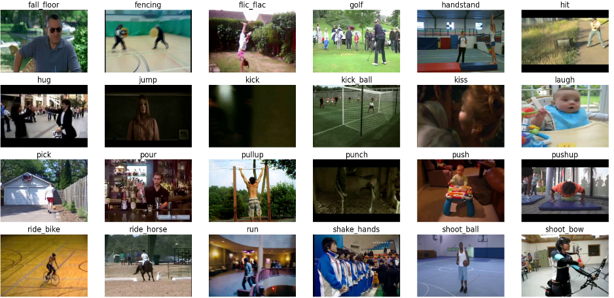
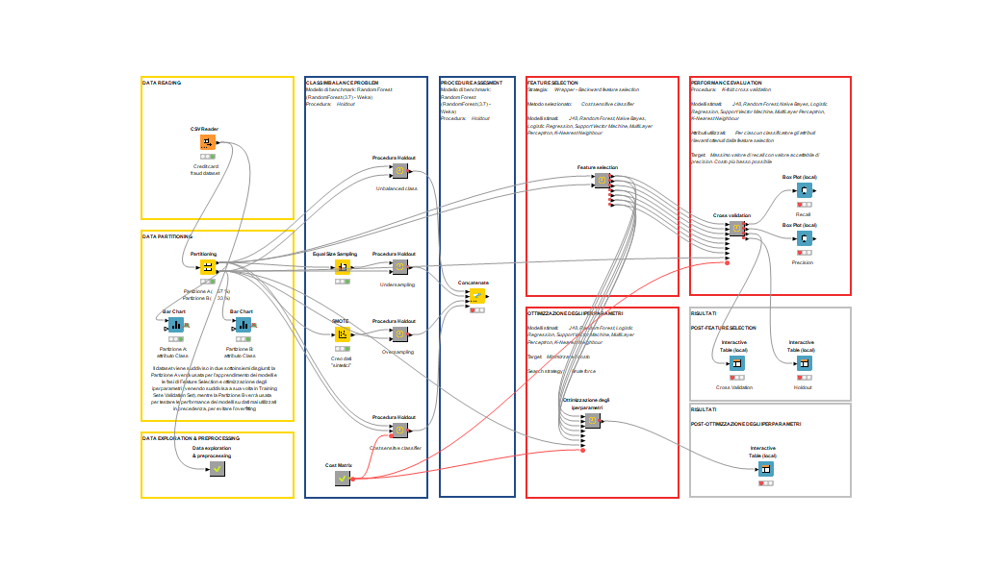
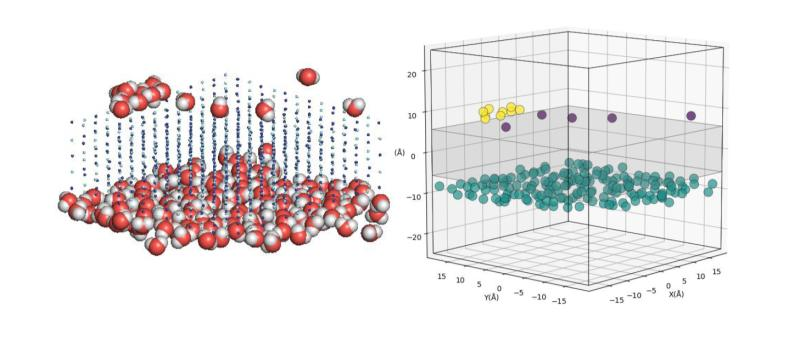
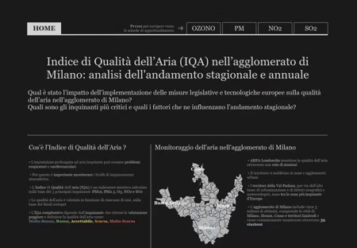
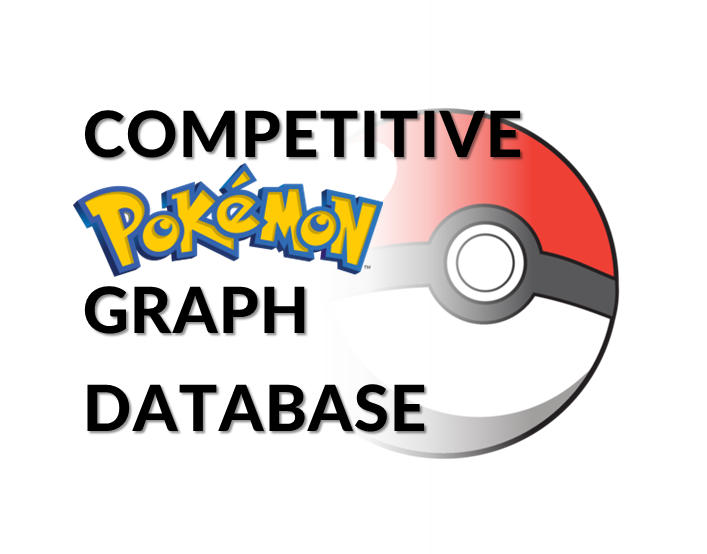

# Portfolio
---

## Deep Learning

### Video Classification: Human Action Recognition on HMDB-51 dataset

We use spatial (ResNet-50 finetuned) and temporal stream cnn (stacked Optical Flows) under the Keras framework to perform Video-Based Human Action Recognition on HMDB-51 dataset.

 

 

---
## Machine Learning

### Credit card transactions fraud detection using KNIME

One of the most critical processes in finance is the <b>detection of fraudulent credit card transactions</b>. It is possible to detect these frauds with different machine learning algorithms, but what is the most effective <b>classifier</b> to accomplish this task?
 
In the first part of the project, we compared different techniques to counter the presence of unbalanced classes within the dataset. Then we compared the performance of some of the most widely used classification algorithms in this area. To determine the best method, we did not limit ourselves to the usual metrics but also took into account the costs to the financial institution related to any errors the model may make, a key aspect in this area.

 

 

---
### Cluster analysis on results of computational chemistry simulations

Data analysis of the results of <b>computational simulations of the water adsorption process</b> on atmospheric particulate matter models.
 
My work involved the development of a script in Python (NumPy, pandas, scikit-learn), capable of performing an automated (frame-by-frame) <b>data analysis of the configurations</b> (atomic coordinates of water molecules) generated during each simulation, conducted at a specific H2O pressure value.

 

 

---
## Data Visualization

### Air quality in the Milan agglomeration: Data Analysis & Visualization

Has <b>air quality</b> improved over the past 15 years in and around <b>Milan</b>? Is the concentration of pollutants higher in winter or summer? and why? What are the main pollutants, and what meteorological and anthropogenic factors influence the seasonal pattern of their concentrations?
 
We tried to answer these, and other, questions by analyzing data from ARPA Lombardy. The results of our analysis were then displayed in an <b>interactive infographic</b> created using the <b>Tableau</b> platform.

 

 

---
### Infographic: PROM score and the possible relationship with weather conditions

<b>PROMs are patient-reported outcome</b> measures following an operation or health treatment, often used to assess the quality of health care.
 
We evaluated the possible presence of a <b>relationship</b> between the <b>outcomes of mental and physical health</b> status assessments of a sample of patients, following surgery, and the <b>weather conditions</b> relative to the time of questionnaire completion.

 

 

---
## Data Management

### Data Acquisition and Modeling: Competitive Pokémon Graph Database

The idea behind the project is to create a <b>graph database</b> containing information related to the <b>competitive Pokémon videogame</b>, with particular reference to the Video Game Championship Series 12 rules, the official format in effect for official tournaments and events during the period February - August 2022 and valid for the Pokémon World Championship in London in August 2022. The goal is to obtain a useful <b>tool as a support for competitive play</b>, both for novice and experienced players. The different <b>Pokémon are placed in relation to the teammates, moves, tools and the basic statistics with which they are most frequently matched</b> within teams in competitive matches. For this reason, the choice on the type of database to be implemented fell on a graph database, implemented through <b>Neo4J</b>. The choice of the graph database allowed us to take advantage of its characteristic of being schema less, which allows us to create nodes, to model the different entities, and arcs, to model the various relationships, without following a predefined schema. The database was populated through data obtained through <b>API</b> and <b>Web Scraping</b>, appropriately integrated and processed.

 

 

---
## Distributional Semantics

### Word Embedding (Word2Vec and CADE): the evolution of tópoi in the Italian literary tradition

Using <b>distibuctional semantics</b> (<b>word2vec</b> family algorithms and the <b>CADE</b> framework) to learn <b>word embeddings</b> from the <b>Italian</b> literary corpuses we generated.
The <b>goals</b> of our project were: 
1. to <b>obtain corpora</b> that were consistent with our research questions from a collection of texts obtained from two main sources 
2. to use distibutional semantics, and in particular algorithms from the word2vec family along with the CADE frameword in order to learn <b>word embeddings</b> from the generated and processed corpora 
3. and finally to <b>analyze</b> some particularly long-lived _tòpos_, chosen arbitrarily, to be able to answer some research questions
The questions we asked ourselves were: 
1. How do the longest-lived literary _tòpos_ change in different historical periods ? and thus Does the historical-cultural context influence the recurring themes ? 
2. How do the canons proper to the different literary currents of Italian literature shape the representation of these common themes ?
3. Given some _tòpos_ and concepts peculiar to some of the greatest authors of Italian literature what are the correspondences in the works of other great authors ?

 

 

© 2022 Carbone Giorgio. Powered by Jekyll and the Minimal Theme.
